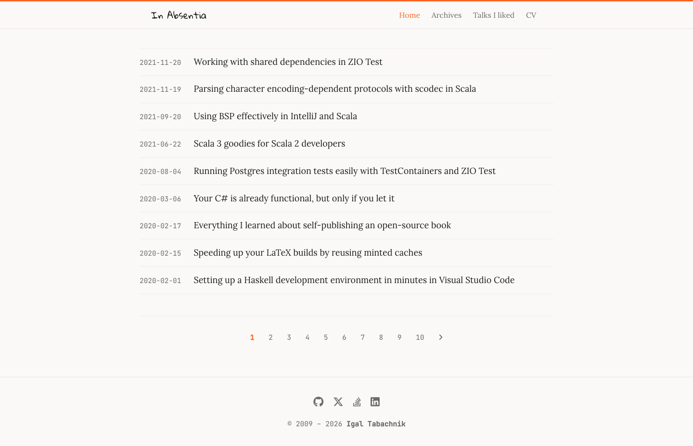

# linen

A minimal, single-column reading theme for [Zola](https://www.getzola.org/). Named for its warm off-white background.



**[Live demo →](https://hmemcpy.com)**

## Design

- **Single column**, centered at 860px — comfortable on any screen
- **Serif body font** ([Lora](https://fonts.google.com/specimen/Lora)) for long-form readability
- **Warm off-white** palette (`#faf9f7` bg, `#1a1a1a` text, `#fc6423` orange for links/accents)
- **Clean post list** — date on the left, title on the right; no cards, no shadows
- **Sticky top nav** with site title and nav links; hamburger on mobile
- **Nord syntax highlighting** with language label on code blocks
- **Social links** in the footer via Font Awesome 6 icons

## Installation

Add the theme as a git submodule:

```bash
git submodule add https://github.com/hmemcpy/zola-theme-linen themes/linen
```

Then set it in your `config.toml`:

```toml
theme = "linen"
```

## Configuration

A full `config.toml` example:

```toml
base_url = "https://example.com"
title = "My Blog"
description = "A short description"
theme = "linen"

compile_sass = true
generate_feeds = true
feed_filenames = ["atom.xml"]

taxonomies = [
    {name = "tags"},
]

[markdown]
[markdown.highlighting]
enabled = true
theme = "nord"

[extra]
author = "Your Name"
avatar = "https://example.com/avatar.jpg"   # used in og: tags
bio = "Short bio shown nowhere by default"

og_site_name = "My Blog"
keywords = "programming, software"
copyright_since = "2020"
copyright_year = "2025"
twitter_username = "@yourhandle"

menu = [
    {name = "Home",     url = "/"},
    {name = "Archives", url = "/posts/"},
]

# Social links in footer — any Font Awesome 6 brand icon
[[extra.social]]
name = "GitHub"
url  = "https://github.com/yourname"
icon = "fab fa-github"

[[extra.social]]
name = "X"
url  = "https://x.com/yourhandle"
icon = "fab fa-x-twitter"
```

## Content

Posts go in `content/posts/`. For posts with images, use [page bundles](https://www.getzola.org/documentation/content/page/#asset-colocation):

```
content/posts/my-post/
├── index.md
└── screenshot.png
```

Reference images with the bundled shortcode:

```
{{ image(path="screenshot.png", alt="Description", caption="Optional caption") }}
```

### Static pages

Pages that should appear in the nav but not the post feed (e.g. an About page):

```toml
+++
title = "About"
[extra]
skip_in_feed = true
+++
```

## Shortcodes

| Shortcode | Description |
|---|---|
| `image(path, alt, caption)` | `<figure>` with optional caption |
| `asset_img(path, alt, caption)` | Alias for `image` |
| `blockquote(author, source)` | Styled blockquote with attribution |

## Customisation

Override any SCSS variable by editing `sass/_variables.scss` after copying the theme, or add site-specific rules to `sass/_custom.scss`. Key variables:

```scss
$orange:            #fc6423;  // accent / link colour
$bg:                #faf9f7;  // page background
$text:              #1a1a1a;  // body text
$content-max-width: 860px;    // column width
$font-family-base:  "Lora", Georgia, serif;
$font-family-mono:  "JetBrains Mono", monospace;
$font-size-base:    18px;
```

## License

MIT
